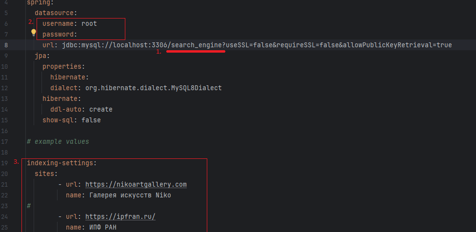
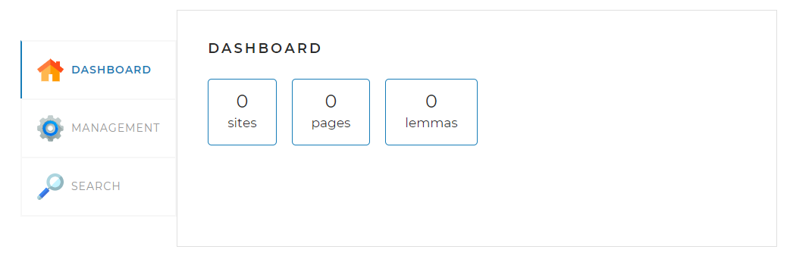
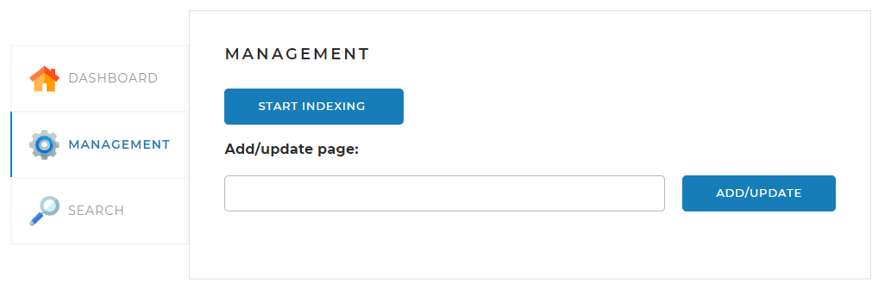
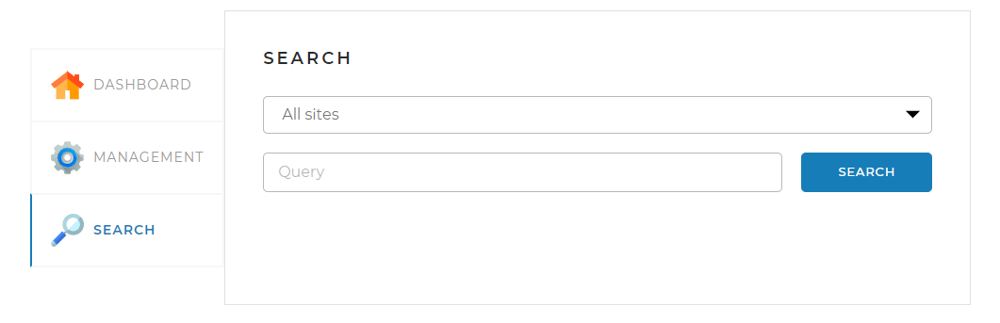
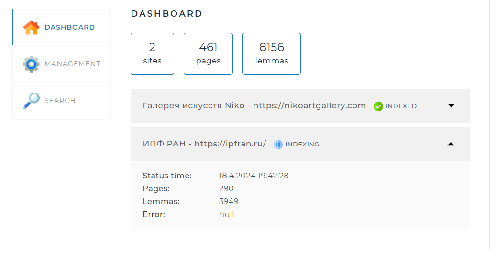
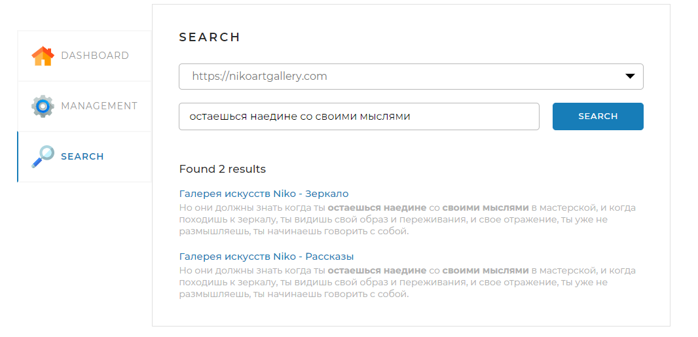

# Поисковой движок "SearchEngine"

## Описание
SearchEngine - это простой поисковый движок, который позволяет пользователям быстро 
и эффективно находить информацию на заранее подготовленных сайтах.

## Стэк технологий
- Язык Java
- Фреймворк Spring
- База данных MySQL

## Установка
1. Клонируйте репозиторий: `git clone https://github.com/Bunchiek/searchengine.git`
2. Для запуска приложения вам необходима база данных MySQL, 
создайте базу согласно конфигурационному файлу (По умолчанию - _search_engine_)
3. Выполните конфигурацию приложения в файле _application.yaml_. 
   1. Укажите название базы данных(если изменяли) 
   2. Введите логин\пароль от базы
   3. Добавьте сайт(ы) на котором необходимо произвести поиск - ссылку и название 
4. 

## Описание пользовательского интерфейса

Главный экран - **DASHBOARD**. Здесь отображается статистика проиндексированных сайтов.
Общие число сайтов, страниц и слов.

Страница **MANAGEMENT** используется для запуска индексации по всем сайтам из файла конфигурации, либо можно добавить отдельную страницу.

Страница **SEARCH** необходима для поиска информации по проиндексированным сайтам. В поле _Query_ вводится поисковый запрос, 
а во всплывающем списке можно выбрать сайты на которых производить поиск, если оставить пустым - поиск будет происходить по всем сайтам.
## Использование
1. Запустите сервер, следуя инструкциям установки.
2. Откройте браузер и перейдите по адресу `http://localhost:8080`.
3. Зайдите на страницу **MANAGEMENT**, запустите индексацию(1) нажав кнопку _Start indexing_. Кнопка изменится на _Stop indexing_, 
она нужна, чтобы остановить индексацию не дожидаясь завершения.
(1)Индексация - процесс "обхода" всех страниц сайта и сохранение в базу данных всех слов на этих страницах.
Для отслеживания процесса индексации перейдите во вкладку **DASHBOARD**. Когда программа закончит индексацию статус сайта измениться _INDEXING -> INDEXED_ .

4. Чтобы выполнять поиск, необходимо чтобы сайт имел статус _INDEXED_.
Перейдите во вкладку **SEARCH** и напишите поисковый запрос. Программа выдаст результаты поиска в порядке релевантности. 

